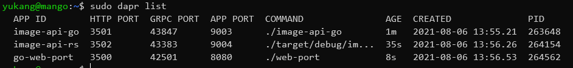

# Dapr-WasmEdge

[DAPR](https://dapr.io/) is a portable, event-driven runtime that makes it easy for any developer to build resilient, stateless and stateful applications that run on the cloud and edge and embraces the diversity of languages and developer frameworks. It's a Microsoft-incubated [open-source](https://github.com/dapr/dapr) project.

[WasmEdge](https://github.com/WasmEdge/WasmEdge) is a open-source, high-performance, extensible, and hardware optimized WebAssembly Virtual Machine for automotive, cloud, AI, and blockchain applications.

In this demonstration App, we create two image classification web services, integrated with Dapr.
This project is built to demonstrate how to use Dapr to integrate Web applications in any programming language, and how WasmEdge can be embed in Go and Rust applications.

This project contains mainly three components:
## 1. The [Web port service](./web-port)
It is a simple Go Web application which is exposed as an endpoint of the whole application.
It will render a static HTML page for the user to upload an image, and receive the image from the user, redirect request to internal image APIs.

## 2. The [Go API](./image-api-go)
It is a Go API service, which is based on Dapr service. This image api will use `WASI` to call a prebuild wasm file to classify an image.

## 3. The [Rust API](./image-api-rs)
Since the Dapr Rust SDK is not ready now, we use `warp` to build this Rust API service. It will call wasm in a command-line style to classify a image.

## Architecture


## How to develop and use a Dapr service
Dapr provides some [SDK](https://docs.dapr.io/developing-applications/sdks/) for different programming languages, it is the easiest way to get Dapr into your application.

The SDK contains Client, Service, and Runtime API, and it is easy to use. For example, we use Service SDK in `go-sdk` to create the `image-api-go` service

```go
func main() {
	s := daprd.NewService(":9003")

	if err := s.AddServiceInvocationHandler("/api/image", imageHandlerWASI); err != nil {
		log.Fatalf("error adding invocation handler: %v", err)
	}

	if err := s.Start(); err != nil && err != http.ErrServerClosed {
		log.Fatalf("error listenning: %v", err)
	}
}
```

In `web-port/web_port.go`, we use Dapr's Client to send request to Service:

```go
func daprClientSend(image []byte, w http.ResponseWriter) {
	ctx := context.Background()

	// create the client
	client, err := dapr.NewClient()
	if err != nil {
		panic(err)
	}

	content := &dapr.DataContent{
		ContentType: "text/plain",
		Data:        image,
	}

	resp, err := client.InvokeMethodWithContent(ctx, "image-api-go", "/api/image", "post", content)
	if err != nil {
		panic(err)
	}
	log.Printf("dapr-wasmedge-go method api/image has invoked, response: %s", string(resp))
	fmt.Printf("Image classify result: %q\n", resp)
	w.WriteHeader(http.StatusOK)
	fmt.Fprintf(w, "%s", string(resp))
}
```
For any Web Service which don't use Dapr SDK but registered as a Dapr instance, we can still can use `http` or `gRpc` to interact with it. Dapr will start a `sidecar` for each service instance. Essentially, `sidecar` works as a proxy for a service instance. We send request to `sidecar`, then the request is forwarded to the service instance. For example, in `web-port/web_port.go` we send a request to Rust api like this(3502 is the port of Sidecar):

```go
client := &http.Client{}
	// http://localhost:<daprPort>/v1.0/invoke/<appId>/method/<method-name>
	req, err := http.NewRequest("POST", "http://localhost:3502/v1.0/invoke/image-api-rs/method/api/image", bytes.NewBuffer(image))
	if err != nil {
		panic(err)
	}
	req.Header.Set("Content-Type", "text/plain")
	resp, _ := client.Do(req)
	defer resp.Body.Close()
	body, _ := ioutil.ReadAll(resp.Body)
	fmt.Fprintf(w, "%s", body)
```

## How to run a Dapr Service
We use this command to start a Dapr service(refer to the commands in `run_*` scripts):

```bash
dapr run --app-id image-api-rs \
         --app-protocol http \
         --app-port 9004 \
         --dapr-http-port 3502 \
         --components-path ../config \
         --log-level debug \
         ./target/debug/image-api-rs
```

Dapr can deployed in [Self-Host mode and in Kubernetes mode](https://docs.dapr.io/operations/hosting/), here we use self-host mode to make this demo simple.

## How to build

```bash
## Install Docker, Dapr, Golang, Rust

## Then install all the dependencies
sudo dapr init
make pre-install

## Build all the components
make build
```
## Run all the services

```bash
## Run the image-api-go
sudo make run-api-go

## Run the image-api-rs
sudo make run-api-rs

## Run the Web port service
sudo make run-web

```
## Verify all the running services

```bash
sudo dapr list
```




## [Online Demo: Dapr-WasmEdge](http://13.93.207.62:8080/static/home.html)

