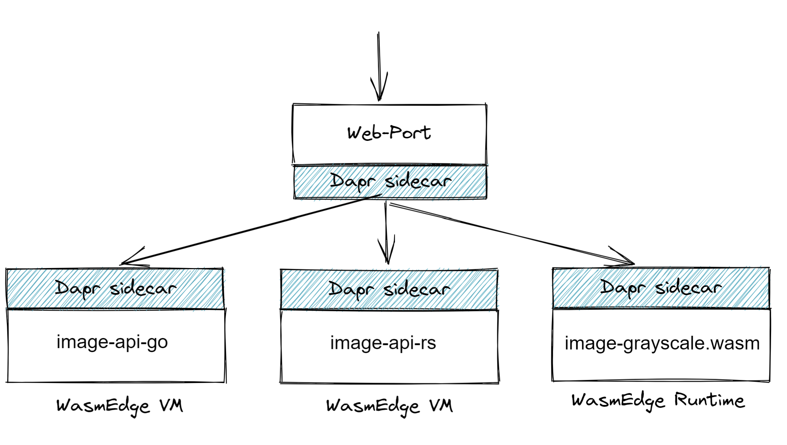
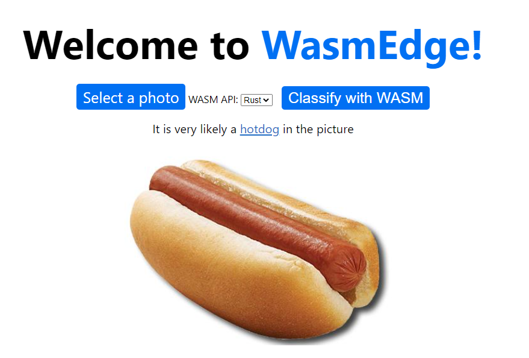

## Demo and tutorials

[Live Demo](http://23.100.38.125/static/home.html) | [Tutorial article](https://www.infoq.com/articles/webassembly-dapr-wasmedge/) | [Tutorial video](https://youtu.be/t_sQP6Qpf7U)

## 1. Introduction

[DAPR](https://dapr.io/) is a portable, event-driven runtime that makes it easy for any developer to build resilient, stateless and stateful applications that run on the cloud and edge and embraces the diversity of languages and developer frameworks. It's a Microsoft-incubated [open-source](https://github.com/dapr/dapr) project.

[WasmEdge](https://github.com/WasmEdge/WasmEdge) is a open-source, high-performance, extensible, and hardware optimized WebAssembly Virtual Machine for automotive, cloud, AI, and blockchain applications.

In this demonstration App, we create two image processing web services, integrated with Dapr.
This project is built to demonstrate how to use Dapr to integrate Web applications in any programming language, and how WasmEdge can be embed in Go and Rust applications.

## 2. Architecture

This project contains 4 Dapr sidecar services:

* The [Web port service](./web-port)

It is a simple Go Web application which is exposed as an endpoint of the whole application.
It will render a static HTML page for the user to upload an image, and receive the image from the user, redirect request to internal image APIs.

* The [image service in WasmEdge](./image-api-wasi-socket-rs)

This Dapr service is written in Rust and compiled to WebAssembly. Running inside WasmEdge Runtime, the WebAssembly bytecode program creates a HTTP service that listens for RPC requests from other Dapr applications, including the [web port](./web-port).

* The [image service in Golang](./image-api-go)

This Dapr service is written in Golang. It uses `WASI` to call a prebuild wasm file to classify an image using a Tensorflow model.

* The [image service in Rust](./image-api-rs)

This Dapr service is written in Rust. It simply starts a new process for the WasmEdge VM to run and perform grayscale on a image.



## 3. Prerequisites

* [Install Golang](https://golang.org/doc/install)
**Note** Package managers like apt will only install older versions of go i.e. go `1.13.8`, so please use link above to install go version `1.17.1` or higher.
* [install Rust](https://www.rust-lang.org/en-US/install.html)
* [Install Dapr](https://docs.dapr.io/getting-started/)
* [Install WasmEdge](https://github.com/WasmEdge/WasmEdge/blob/master/docs/install.md)


## 4. Build

```bash
make pre-install  ## Install WasmEdge dependences
make build        ## Will build all the components

## If you modify the wasm functions project,
## Use the commands in ./functions/grayscale/build.sh 
## and ./functions/classify/build.sh to generate new compiled files
make build-wasm
```
## 5. Run

To simplify the deployment, we provide a script to run the services:

```bash
make run-api-wasi-socket-rs ## Run the WasmEdge microservice
make run-api-go ## Run the image-api-go microservice
make run-api-rs ## Run the image-api-rs microservice
make run-web ## Run the Web port service
```

For each component, you can also run it individually:

### Start the web-port service

```bash
cd web-port
dapr run --app-id go-web-port \
         --app-protocol http \
         --app-port 8080 \
         --dapr-http-port 3500 \
         --components-path ../config \
         --log-level debug \
         ./web-port
```

### Start the WasmEdge microservice for image processing

```bash
cd image-api-wasi-socket-rs
dapr run --app-id image-api-wasi-socket-rs \
         --app-protocol http \
         --app-port 9005 \
         --dapr-http-port 3503 \
         --components-path ../config \
         --log-level debug \
	 wasmedge ./target/wasm32-wasi/debug/image-api-wasi-socket-rs.wasm
```

```bash
cd image-api-go
dapr run --app-id image-api-go \
         --app-protocol http \
         --app-port 9003 \
         --dapr-http-port 3501 \
         --log-level debug \
         --components-path ../config \
         ./image-api-go
```

### Start the image-api-rust service

```bash
cd image-api-rs
dapr run --app-id image-api-rs \
         --app-protocol http \
         --app-port 9004 \
         --dapr-http-port 3502 \
         --components-path ../config \
         --log-level debug \
         ./target/debug/image-api-rs
```

After all the services started, we can use this command to verify:

```bash
dapr list
```

```
  APP ID                     HTTP PORT  GRPC PORT  APP PORT  COMMAND               AGE  CREATED              PID
  go-web-port                3500       44483      8080      ./web-port            15m  2021-10-23 12:19.59  270961
  image-api-wasi-socket-rs   3503       41775      9005      wasmedge              9m   2021-10-23 12:25:27  294758
  image-api-rs               3502       41661      9004      ./target/release/...  9m   2021-10-23 12:25.27  285749
  image-api-go               3501       34291      9003      ./image-api-go        9m   2021-10-23 12:25.27  285852
```

## 6. Online Demo: Dapr-WasmEdge

[Access the demo here](http://23.100.38.125/static/home.html)



